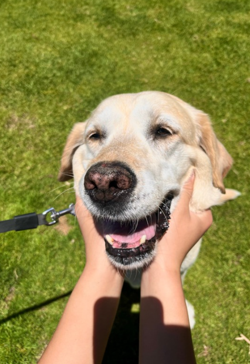

<html>
<head>
    <link rel="stylesheet" href="style.css">
</head>
<body>
    

    
    
Nighthawk Page: Zoe He

    <h1 style="color:white; font-faimly:serif;"> Hi, my name is Zoe!</h1>
    <marquee direction = right>
        
    </marquee>
    

<!-- -->
</body>
</html>
