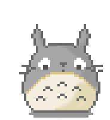
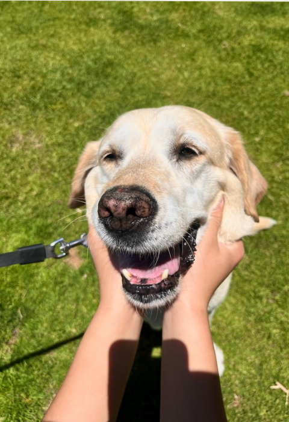

<!-- Liquid:  statements -->

<!--- Concatenation of site URL to frontmatter image  --->

<!--- Has is a list variable containing mario metadata for sprite --->
  
<!--- Size width/height of Sprit images --->


<!--- HTML for page contains 
 tag named "Mario" and class properties for a "sprite"  -->

 
<!--- Embedded Cascading Style Sheet (CSS) rules,
        define how HTML elements look
--->

<!--- Embedded executable code--->

<html>
<meta name="viewport" content="width=device-width, initial-scale=1">
<head>
    <link rel="stylesheet" href="/style.css">
    <meta charset="UTF-8">
    <meta http-equiv="X-UA-Compatible" content="IE=edge">
    <link rel="preconnect" href="https://fonts.googleapis.com">
    <link rel="preconnect" href="https://fonts.gstatic.com" crossorigin>
    <link href="https://fonts.googleapis.com/css2?family=Nunito:wght@800&display=swap" rel="stylesheet">
    <link rel="stylesheet" href="https://cdnjs.cloudflare.com/ajax/libs/font-awesome/6.4.0/css/all.min.css"
        integrity="sha512-iecdLmaskl7CVkqkXNQ/ZH/XLlvWZOJyj7Yy7tcenmpD1ypASozpmT/E0iPtmFIB46ZmdtAc9eNBvH0H/ZpiBw=="
        crossorigin="anonymous" referrerpolicy="no-referrer" />
    <meta name="viewport" content="width=device-width, initial-scale=1.0">
<body>
    

Hi, my name is Zoe He

(Mario can move)

 
 
 
<a href="http://127.0.0.1:4100/student_2025/picture/"
    button class="button"> Click here to see a picture!
</a>
 
<iframe style="border-radius:12px" src="https://open.spotify.com/embed/playlist/1vKlnFo34ktfVDRvR1Oycz?utm_source=generator" width="100%" height="152" frameBorder="0" allowfullscreen="" allow="autoplay; clipboard-write; encrypted-media; fullscreen; picture-in-picture" loading="lazy"></iframe>
<div2 class="dropdown">
  <button class="dropbtn">Click here for more!</button>
  <div2 class="dropdown-content">
    <a href="http://127.0.0.1:4100/student_2025/about/">About Me</a>
    <a href="http://127.0.0.1:4100/student_2025/tools/">Tools</a>
    <a href="http://127.0.0.1:4100/student_2025/emoji/">Emoji</a>
    <a href="http://127.0.0.1:4100/student_2025/javascript/">Javascript</a>
    <a href="http://127.0.0.1:4100/student_2025/reflection/">Reflection </a>

  </div2>

  <button class="dropbtn">Click here for games!</button>
  

    <a href="http://127.0.0.1:4100/student_2025/cookie/">Cookie Clicker</a>
    <a href="http://127.0.0.1:4100/student_2025/calc/">Calculator</a>
    <a href="http://127.0.0.1:4100/student_2025/snake/">Snake Game</a>
  

<!--

  <label class="toggle_label">
    <input type="checkbox" id="mode" class="toggle">
    
      <i class="fa-solid circle"></i>
      <i class="fa-solid circle"></i>
    
  </label>
  

  

<!---->