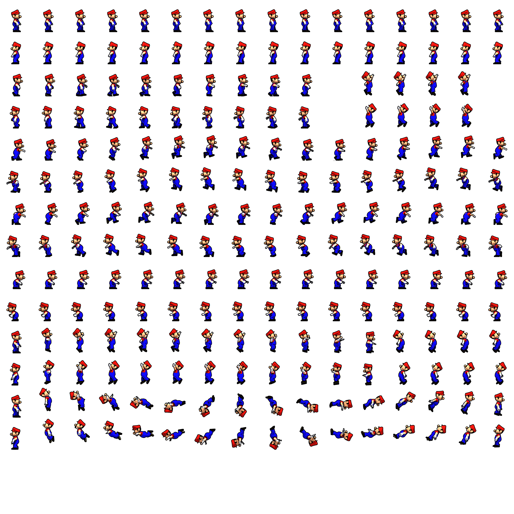

<html>
<head>
    <link rel="stylesheet" href="style.css">
<body>
    
    

        
Hello, my name is Zoe He!

    

    <a href="http://127.0.0.1:4100/student_2025/tools/"
        button class="button">Tools
    </a>
        

  <!---->
  <!--  
Hello, my name is Zoe He!
-->
